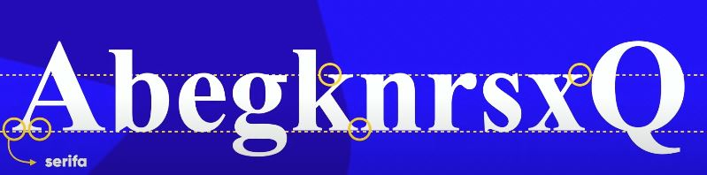

# Sumário
- [Representando cores com CSS](#representando-cores-com-css)
- [Harmonia de cores](#harmonia-de-cores)
    - [Círculo Cromático](#círculo-cromático)
        - [Cores Primárias](#cores-primárias)
        - [Cores Secundárias](#cores-secundárias)
        - [Cores Terciárias](#cores-terciárias)
    - [Cores Complementares](#cores-complementares)
    - [Cores Análogas](#cores-análogas)
        - [Cores Análogas Relacionadas](#cores-análogas-relacionadas)
    - [Cores Triádicas](#cores-triádicas)
    - [Cores Quadráticas](#cores-qudráticas)
    - [Cores Tetrádicas](#cores-tetrádicas)
    - [Monocromia](#monocromia)
    - [Gradiente](#gradiente)
    - [Tipografia](#tipografia)
        - [Anatomia do tipo](#anatomia-do-tipo)
            - [Serifa](#serifa)
            - [Categoria de fonte](#categoria-de-fontes)
        - [Família de fonte](#família-de-fonte)
        - [Tamanho de fonte e suas medidas](#tamanho-de-fonte-e-suas-medidas)
        - [Peso da fonte](#peso-da-fonte)
        - [Shorthand Font](#shorthand-font)
        - [Importando Fontes do Google Fonts](#importando-fontes-do-google-fonts)
        - [Importando fontes que não estão no Google Fonts](#importando-fontes-que-não-estão-no-google-fonts)
        - [Alinhamento de texto](#alinhamento-de-texto)
        - [Id e classes](#id-e-classes)
        - [Diferença entre id e class](#diferença-entre-id-e-class)
        - [Pseudo Classes](#pseudo-classes)
                - [:visited](#visited)
                - [:hover](#hover)
                - [:active](#active)
        - [Pseudo-elementos](#pseudo-elementos)
            - [::after](#after)
            - [::before](#before)
            


## Representando cores com CSS

 Exitem 3 formas de fazer a representação de cores em CSS:

 - Representando-as pelos nomes das cores

 ```html
 <h2 style="background-color: blue; color: white;">Exemplo de Cores</h2>
 ```

 - Representando-as por códigos hexadecimais, onde o tom mais baixo é 0 que
 significa tons mais escuros e o tom mais forte é 255 que significa tons mais claros.

 **A denominação RGB vem de: R(Red), G(Green) e B(Blue). Quanto mais baixo, mais escuro é a cor, quanto mais alto, mais claro é a cor**

 ```html
  <h2 style="background-color: rgb(0, 0, 255); color: rgb(255, 255, 255);">Exemplo de Cores</h2>
 ```

 - Representando-as por HSL
    - H(Hue ou Matriz) - Define a cor do objeto. No modelo HSL, o matiz é representado por um ângulo de 0 a 360 graus, onde 0 e 360 correspondem ao vermelho, 120 ao verde e 240 ao azul.

    - S(Saturation) - Define a intensidade da cor. Quanto maior a saturação, mais vibrante e intensa será a cor. No modelo HSL, a saturação é representada por um valor de 0 a 100%, onde 0% corresponde a uma cor completamente desaturada (tons de cinza) e 100% a uma cor totalmente saturada (corestão vibrantes).

    - L(Luminosity) - Define a claridade da cor.No modelo HSL, a luminosidade é representada por um valor de 0 a 100%, onde 0% corresponde ao preto absoluto e 100% ao branco absoluto. Valores intermediários representam diferentes níveis de luminosidade, permitindo criar uma ampla gama de tons e nuances de uma mesma cor.

```html
<h2 style="background-color: hsla(0, 100%, 50%, 0.928); color: hsl(0, 0, 100);">Exemplo de Cores</h2>
```
## Harmonia de cores

Uma paleta de cores tem de 3 à 5 cores.

### Círculo Cromático

Ao fazer um corte central no círculo, entre o vermelho-arroxeado e o amarelo-esverdeado, do lado esquerdo estão as cores frias e do lado direito as cores quentes

#### Cores primárias

- Amarelo
- Vermelho
- Azul

Estão simétricas no círculo cromático e formam um triângulo, formando uma harmonia.

#### Cores Secundárias

- Laranja
- Violeta
- Verde

#### Cores Terciárias

Mistura das cores primárias e secundárias. Elas são de tons pastéis e formam um hexágono no círculo cromático.

### Cores Complementares

Ao escolher as cores para compor um site, depois de escolher uma cor, a cor que mais combina com a cor escolhida está exatamente na sua oposição.

### Cores Análogas

São cores que não tem muito contraste uma com a outra, mas ainda assim são perceptives. Elas se sencontram ao lado uma da outra, ou seja, são cores vizinhas.

#### Cores Análogas Relacionadas


### Cores Triádicas

Combinação de três cores que estão igualmente espaçadas no círculo cromático, formando um triângulo equilátero.


### Cores Qudráticas

É uma harmonia semelhante à harmonia de cores triádicas, exceto que neste esquema harmónico existem quatro cores, todas equidistantes no círculo cromático.


### Cores Tetrádicas

Esquema de cores que se caracteriza por uma paelte de quatro cores uniformemente distribuídas no círculo cromático, formando dois pares de cores complementares.

Para obter as cores tetrádicas, é necessário traçar um retângulo comprido no centro do círculo cromático.


### Monocromia

Trabalha somente com uma cor com a mudança de duas características, luminosidade e saturação.

## Gradiente

Para configurar uma cor gradiente em um elemento, é necessário escolher o seletor, que nesse nosso caso é o ``body``, que permite que todo o corpor da página seja configurado de uma mesma forma.

Depois disso, passar a propriedade
`backgroung-image` que recebe o módulo `linear-gradient` ou `radial-gradient` dependendo da forma que vc deseja usar o gradiente.

Esse módulo leva como primeiro parâmetro a direção para onde a cor gradiente irá se deslocar `to right` ou `to left` ou `to up` ou `to down` ou ainda pode receber ângulos como `45deg`.

No caso do primeiro parâmetro, se optar pelo `radial-gradient`, ele deve ser necessariamente `circle`.

Ainda é possível passar porcentagem depois da cor para indicar o quanto daquela cor irá preencher a tela, por exemplo `#F5EE00 10%`. Isso faz com que a referida cor ocupe 10% da página.

```css

body{
    background-image: linear-gradient(to right, #F5EE00, #F5BB00, #E800F5, #6200F5,#A09C35);
}

```

## Tipografia

### Anatomia do tipo

Todas as letras minúsculas de uma fonte é baseada na letra 'x'. A altura das letras minúsculas é conhecida como **altura-x**.

Já a altura das letras maiúsculas é conhecida como **altura das maiúsculas**.

Algumas letras minúsculas vazam da altura, que conhecemos como altura-x, tanto para cima, como as letras 'k' e 'b', quanto para baixo, como a letra 'g'. Esse vazamento das letras para cima é chamado de **ascendente**, já o vazamento das letras para baixo é denominado **descendente**.

A altura total das letras considerando desde a altura das maiúsculas até o vazamento descendente das minúsculas é chamado de **corpo**.

#### Serifa

É um pequeno traço, barra ou prolongamento que se encontra no final das hastes de algumas letras, números e símbolos.



#### Categoria de Fontes

- **Serif** - Esse estilo de fonte é caracterizado por um design mais conservador.

    - **Marcas que usam serifas:** Zara, Tiffany & Co, Abercrombie & Fitch.

    - **Psicologia das fontes serifadas:** são populares entre empresas que buscam retratar uma marca **elegante e sofisticada.** Os logotipos com esses tipos de fontes evocam **tradição, respeito e confiança.** Além disso, as serifas ajudam as empresas a parecerem mais estabelecidas e são ideais para comunicar uma **identidade baseada em autoridade e grandeza.**

- **Sans-Serif -** Essas fontes são definidas pelas suas **linhas retas e simples.** Elas **não apresentam floreios e enfatizam a legibilidade e a simplicidade.**

    - **Marcas que usam fontes não serifadas:** LinkedIn, Calvin Klein e The Guardian.

    - **Psicologia da fonte não serifada:** esses tipos de fontes oferecem um **visual simples e descomplicado.** Elas **enfatizam a clareza**, com uma abordagem progressista – ***mas também podem ser ousadas e usadas para chamar a atenção com seu design refinado e eficiente.** As empresas que escolhem essa família de fontes priorizam um **senso de sensibilidade e honestidade** que não tem necessidade de floreios ou firulas.

- **Monoespaçada:** Se caracteriza por ter todas as letras e caracteres ocupando o mesmo espaço horizontal.


- **Handwritting (Script) -** Esses tipos de fontes também deixam de lado o visual de impressão compacto e **favorecem o estilo cursivo, mais natural.**

    - **Marcas que usam fontes caligráficas:** Coca-Cola, Instagram e Cadillac.

    - **Psicologia das fontes caligráficas:** evocam ideias de ***elegância, criatividade, liberdade e feminilidade.** Seus estilos curvados e floreados também comunicam uma **abordagem comercial mais prática e pessoal.** As empresas que querem transmitir uma emoção específica podem usar fontes caligráficas com um grande impacto. Da mesma forma, fontes caligráficas **são perfeitas para quem deseja transmitir uma sensação de pensamento singular e artístico.**

- **Decorativas (Display) -** As fontes decorativas, ou gráficas, **renunciam às convenções em favor de um corpo tipográfico único e atraente.** A maioria dos tipos decorativos é útil para diversos setores e necessidades, pois essas fontes geralmente são criadas sob medida para empresas específicas.

    - **Marcas que usam fontes decorativas:** Toys R’ Us, Lego e Fanta.

    - **Psicologia das fontes decorativas:** **transmitem singularidade e enfatizam a originalidade.** Além disso, sua flexibilidade permite às empresas decidirem em quais emoções se concentrarem, misturando e combinando diferentes estilos de fontes. Algumas das emoções mais desencadeadas são a sensação de **informalidade, diversão e pensamento criativo.** Elas também podem evocar memes específicos da cultura ou características ou temas que lembram uma determinada época.


### Tamanho de fonte e suas medidas

Existem várias formas de determinar o tamanho da fonte e podem ser dividas em medidas absolutas e medidas relativas.

Medidas absolutas:

- Centímetro
- Milímetro
- Polegadas
- Pixel
- **Ponto**
- **Paica**

**OBS.: As duas últimas são medidas de tamanho de fonte para papel impresso e não é recomendadaa a sua utilização para material digital.**

Medidas relativas: 

- em - relativo à altura m maiúsculo

 - ex - relativo à altura x de uma fonte

 - rem - relativo ao root

 - view-width - Porcentagem da largura do tamanho de tela

 - view-heigth - Porcentagem da altura do tamanho de tela

 A W3C recomenda-se o uso, para medidas de fontes, somente do **px** e do **em**.

 **16px é o tamanho normal da fonte no site e equivale à 1em.**

 Como cada dispositivo tem diferentes tamanhos e diferentes pixels, a utilização da medida de pixel para tamanho de fonte pode ser diferente dependendo do disposito. Nesse caso, o mais indicado é a utilização da medida em, pois faz uma relação ao tamanho natural da fonte.

 ### Peso da fonte

 O peso da fonte significa a intesidade da fonte. Estão dividadas em lighter, normal, bold ou bolder. Entretanto, nem todas as fontes têm essas variações.

Também é possível escolher a intensidade da fonte através de numeração. A numeração vai de 100 a 900, permitindo uma maior gama de variações para escolher.

```css

font-weight = ligther
```

### Shorthand Font

É uma configuração que permite atribuir propriedades as fontes.

```css

font: italic bolder 1.5em 'work sans', sans-serif;
```
**IMPORTANTE:** A ordem para fazer um shorthand em um fonte é a descrita acima.

### Importando fontes do Google Fonts

Existem algumas fontes que não estão disponíveis em um primeiro momento. Para torná-las disponíveis e conseguir usá-las dentro dos códigos é necessário fazer uma importação da fonte deseja.

Para isso, é necessário fazer essa importação na parte CSS do seu código, como mostrado abaixo:

```html
<style>
@import url('https://fonts.googleapis.com/css2?family=Handlee&display=swap');
</style>
```

Também é possível fazer essa importação dentro do HTML, dentro da tag `<head>` do seu site, como mostrado abaixo:

```html
<head>
    <link rel="preconnect" href="https://fonts.googleapis.com">
<link rel="preconnect" href="https://fonts.gstatic.com" crossorigin>
<link href="https://fonts.googleapis.com/css2?family=Courier+Prime:ital,wght@0,400;0,700;1,400;1,700&display=swap" rel="stylesheet">

</head>
```

Depois disso, para usar a fonte importada no elemento desejado, basta informar o nome da fonte como valor na propriedade `font-family`.

### Importando fontes que não estão no Google Fonts

Para importar uma fonte específica que não está no google fonts, é necessário baixá-la, criar uma pasta para guardar essa fonte dentro do arquivo onde está localizado o seu código e importá-la usando o `@font-face`

Ele recebe atributos como:

- ``font-family`` que é o nome que você quer dar a essa fonte

- `src: url()` que é o local onde a fonte está salva.

- `format` que é o formato da fonte. Existem alguns tipos de formato, como:
    - opentype (otf)
    - truetype (ttf)
    - embedded-opentype 
    - truetype-aat (Tipografia avançada da Apple)
    - svg

    Cada navegador é compatível com um ou outro formato.

```html
<style>
        @font-face {
            font-family: 'Stitch' ;
            src: url('./fonts/Stitch-Party.ttf') format('truetype')
        }
</style>
```

### Alinhamento de texto

Para alinhar os textos na página, basta passar as seguintes regras de CSS:

```css
     h1{
            text-align: center;
        }
        h2{
            text-align:  right;
        }
        p{
            text-align: justify;
            text-indent: 30px;
        }
```

`text-indent` é uma regra de css que permite um espaçamento da primeira linha do parágrafo.

## id e classes

Muitas vezes, você vai querer dar estilo a um elemento específico. Por exemplo, se quiser colocar estilo em um elemento `<h1>` específico e não em todos, é necessário que esse `<h1>` possua um id ou uma class.

```html
<h1 id="principal">Criando sites com HTML e CSS</h1>
```

```css
h1{
    color: green;
}

h1#principal{
    color: brown;
}
```

O primeiro `h1` dá o estilo à todos `h1`, entretanto o `h1#principal` coloca estilo somente aos `h1` que tem o id `#`.

**OBS.: Se usa `#` para id e `.` para as classes.**

## Diferença entre id e class

O Wc3 orienta em suas diretrizes que o id deve ser único e as classes podem ser múltiplas. Então, se quiser estilizar mais de um elemento utilize o ``class`` para dar nome aos elementos. 

## Pseudo Classes

Especifica um estado especial do elemento selecionado. Por exemplo, `:hover` pode ser usado para alterar a cor de um botão quandp p usuário passar o cursos sobre ele.

```css
/*Qualquer botão sobre o qual o ponteiro do usuário esteja passando sobre*/
button:hover {
  color: blue;
}
```
Pseudo-classes permitem que você aplique um estilo a um elemento não apenas em relação ao conteúdo da árvore do documento, mas também em relação a fatores externos como o histórico de navegação (`:visited`, por exemplo), o status do seu conteúdo (como `:checked` em certos elementos de um formulário), ou a posição do mouse (como `:hover`, que permite saber se o mouse está sobre um elemento ou não).


### :visited 

Estilização de links que foram visitados.

```css
a:visited{
    color: red;
}   
```

### :hover

Estiliza o elemento quando o mouse está sobre ele.

```css
a:hover{
    color: blue;
    text-decoration: underline;
}
```

### :active

Muda a cor do elemento quando o usuário clica nele.

```css
a:active{
    color: red;
}
```
## Pseudo-elementos

São palavras reservadas que começam com dois pontos duplos `::`.

### ::after

Adiciona conteúdo depois do conteúdo do elemento.

```css
p::after{
    content: 'Texto inserido pelo autor do artigo';
}
```

### ::before

Adiciona conteúdo antes do conteúdo do elemento.

```css
p::before{
    content: 'Texto inserido pelo autor do artigo';
}
```


